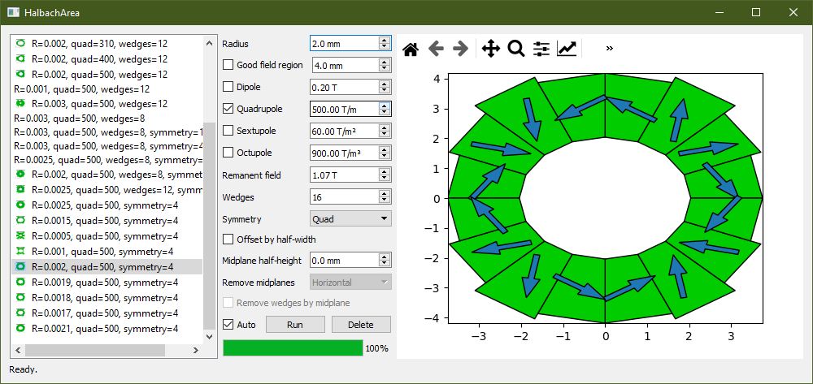

# Quadrupole
Design and build a model of a quadrupole magnet, using either Opera-2D, Opera-3D or Radia. There are many aspects in common between these codes, I wanted to simplify the process of building the geometry and have a unified approach to optimising parameters in terms of field gradient and field quality.

# Halbach_Area
This script is a wrapper for Stephen Brooks' excellent [HalbachArea](https://stephenbrooks.org/ap/halbacharea/) tool, which produces a 2D layout for a Halbach multipole magnet, given parameters such as dipole strength, quadrupole strength, radius and so on. All I've done is wrap a nice GUI around it to (hopefully) ease the process of developing a PM-based multipole magnet. 

